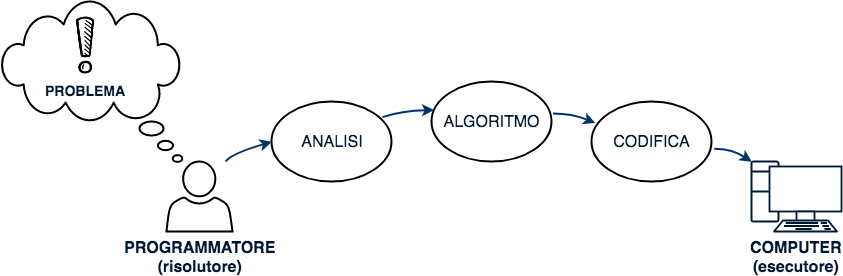
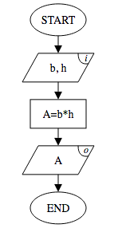
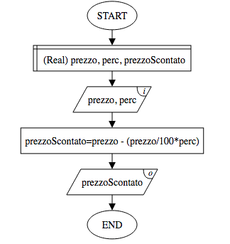
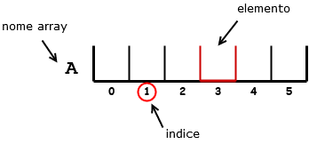
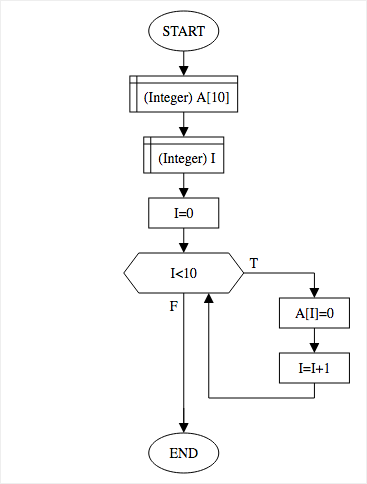
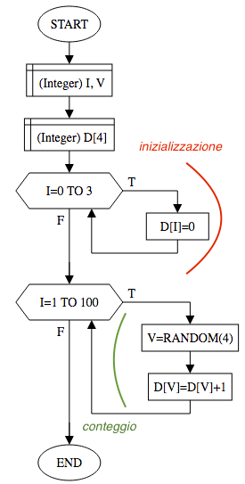
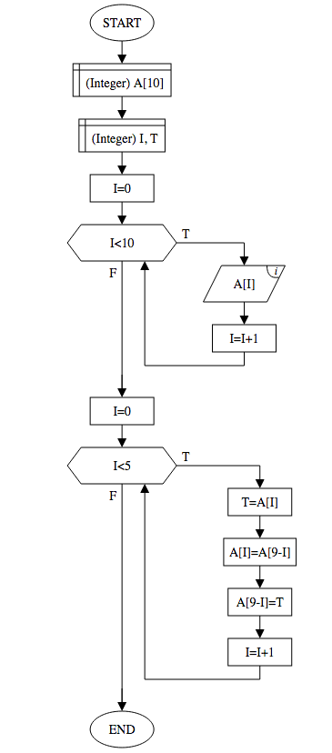
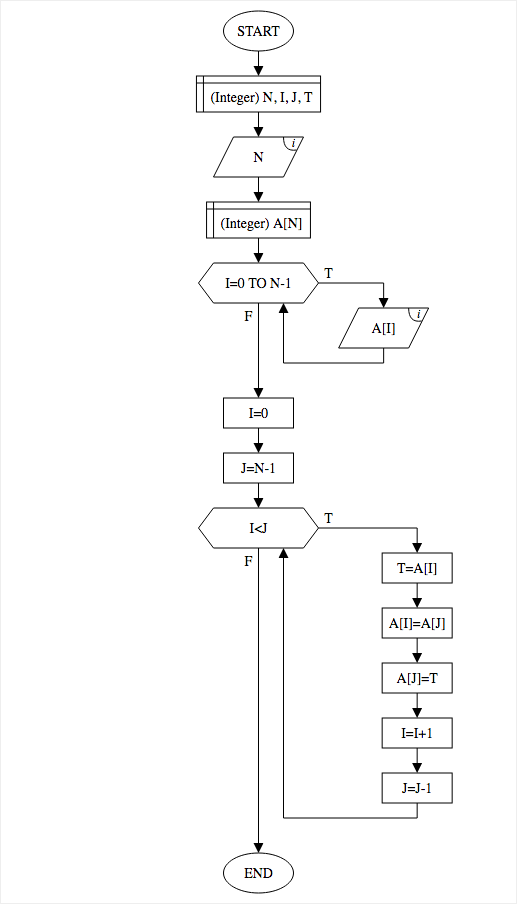

# Cos’é un algoritmo

L'informatica, tramite l'uso del computer, ci permette di risolvere problemi del mondo reale. Problemi che senza l'uso del computer non sarebbero risolvibili. 

Questo perchè il  computer ha due caratteristiche fondamentali:
$$
\text{CAPACITA' DI CALCOLO}+\text{CAPACITA' DI MEMORIZZARE DATI}
$$
Rispetto alla mente umana è in grado di svolgere calcoli in maniera enormemente più rapida ed è in grado di memorizzare  dati in quantità teoricamente illimitata.

Il computer però ha un grande limite: <u>non è in grado di pensare in maniera autonoma</u>; questo significa che non può risolvere problemi che non conosce, problemi per cui non è stato programmato.

Ha quindi bisogno di qualcuno che gli dica come fare. Questo qualcuno è il <u>programmatore</u> (da con confondere con l'utente generico che utilizza il computer).

> **Programmatore:** in inglese *programmer (/ˈprəʊgræməʳ/)* , *developer (/dɪˈvɛləpə/)*, *software engineer (/ˈsɒftˌwɛə ˌɛndʒɪˈnɪə/)*, persona che insegna al computer a saper fare qualcosa.

$$
\text{Programmatore} \ne \text{Utente del computer}
$$

> **Utente del computer:** in inglese *end user (/ɛnd ˈjuːzə/)*, colui che utilizza il computer, che sa fare qualcosa con esso. 

Il programmatore indica al computer come fare per trovare la soluzione, il computer esegue le istruzioni e risolve il problema. 

> **Il computer risolve unicamente problemi che l'uomo ha già risolto.**Tuttavia lo fa in maniera rapida e precisa.

## Risolutore ed esecutore

Possiamo pensare all'uomo e al computer come a due parti che collaborano insieme per risolvere un problema. In generale queste due figure prendono il nome di RISOLUTORE ed ESECUTORE.

> In generale, **l'esecutore** è colui che esegue in maniera rigorosa le istruzioni che gli sono state impartite dal RISOLUTORE. 

> In generale, **il risolutore** è colui che risolve un problema trovando la giusta sequenza di istruzioni da svolgere per arrivare alla soluzione.

Come è facile capire, RISOLUTORE e ESECUTORE  sono indispensabili uno all'altro ed entrambi concorrono attivamente alla risoluzione del problema.

*Esempio Apollo 13*

## L'algoritmo

Il risolutore per insegnare correttamente all'esecutore a risolvere il problema, ha bisogno di fornirgli un elenco ordinato e ben preciso di azioni da svolgere. Questo elenco prende il nome di **algoritmo**.

Che cos’è un algoritmo? Si mangia?» chiese Lori. «Cosa? No, è solo un modo elegante di dire “come si fa qualcosa”.

> **Algoritmo:** in inglese *algorithm (/ˈælɡəˌrɪðəm/)*, procedimento che risolve un determinato problema attraverso un numero finito e ordinato di passi (azioni, istruzioni).

Un algoritmo per essere definito tale deve possedere le seguenti caratteristiche:

- finitezza
- non ambiguità
- generalità
- efficienza

## Fasi di risoluzione di un problema

Scrivere un algoritmo per insegnare al computer a "saper fare" qualcosa necessita, in atto pratico, di una sequenza di passaggi da dover svolgere. L'algoritmo è solo la parte centrale di una serie di attività che permettono al programmatore di risolvere il problema in tutte le sue parti. L'algoritmo viene preceduto da una fase di analisi del problema e viene seguito da una fase di codifica in cui sarà convertito in codice di programmazione per poter dar vita al **software**.

| 1. ANALISI                            | 2. PROGETTAZIONE                                             | 3. CODIFICA                                             |
| ------------------------------------- | ------------------------------------------------------------ | ------------------------------------------------------- |
| Identificazione dati in INPUT         | Progettazione e scrittura dell'algoritmo (flowchart o pseudocodifica) | Scrittura del codice in un linguaggio di programmazione |
| Identificazione dati in OUTPUT        | Test dell'algoritmo (tracing)                                | Compilazione del codice                                 |
| Creazione di una strategia risolutiva |                                                              | Testing del codice                                      |

L'analisi produce una **strategia risolutiva** &#8594; in base alla strategia risolutiva si progetta un **algoritmo** &#8594; l'algoritmo viene codificato in un linguaggio di programmazione per ottenere un **software**.

# L'analisi del problema

Svolgere l'analisi del problema significa innanzitutto <u>capire</u> il problema. Una volta capito il problema è possibile identificarne i dati in INPUT e i dati in OUTPUT  e quindi individuare e descrivere un metodo effettivo di soluzione. 

> **Identificare i dati in INPUT:** determinare i parametri del problema ovvero tutte le variabili da valorizzare con i dati iniziali.

> **Identificare i dati in OUTPUT:** determinare la o le soluzioni del problema (le incognite).

> **Individuare una strategia risolutiva:** saper modelizzare o descrivere una soluzione che permetta di risolvere il problema in maniera corretta.

Per ogni variabile coinvolta è bene determinarne il dominio in modo da specificare i valori accettati.

*Analisi - Esempio 1*
Problema: avendo base e altezza di un triangolo determinare l'area.
Soluzione:
$$
Input: b,h \in \R \enspace|\enspace b,h>0\\
Output: Area \in \R \\ 
SR: Area = b*h
$$

*Analisi - Esempio 2*
Problema: date le misure dei lati di un triangolo determinare il tipo di triangolo (scaleno, isoscele, equilatero).
Soluzione:
$$
\begin{align*}
Input:\enspace a,b,c \in \mathbb{R} \enspace|\enspace a,b,c>0\\
Output:\enspace tipo \in \{scaleno,isoscele,equilatero\}\\
SR:\enspace (a=b)\land(b=c) \implies equilatero\\
   \enspace altrimenti \enspace (a=b)\lor(a=c)\lor(b=c) \implies isoscele\\
   \enspace altrimenti \implies scaleno
\end{align*}
$$

*Analisi - Esempio 3*
Problema: dati tre segmenti determinare se con essi sia possibile costruire un triangolo.
Soluzione:
$$
Input: a,b,c \in \mathbb{R} \enspace|\enspace a,b,c>0\\
Output: esito \in \{Vero,Falso\}\\
SR: (a<b+c) \land (b<a+c) \land (c<a+b) \implies Vero \\
altrimenti  \implies Falso
$$

*Analisi - Esempio 4*
Problema: dato un numero intero determinarne il precedente e il successivo
Soluzione:
$$
Input: n \in \mathbb{Z}\\
Output: prec,succ \in \mathbb{Z}\\ 
SR: prec=n-1\\
succ=n+1
$$
*Analisi - Esempio 5*
Problema: dato l'anno di nascita di una persona determinarne l'età
Soluzione:
$$
Input: annoC,annoN \in \mathbb{N}\enspace|\enspace anno>1900\\
Output: eta \in \mathbb{N}\enspace|\enspace anno>0\\ 
SR: eta = annoC-annoN
$$

*Analisi - Esempio 6*
Problema: calcolare la somma di tutti i numeri naturali compresi tra 1 e 100, estremi inclusi.
$$
Input: -\\
Output: somma \in \mathbb{N}\enspace|\enspace anno>0\\
SR:somma = {(1+100)*100 \over 2}
$$
N.B. questo esempio prende spunto dal famoso problema del piccolo Gauss. Si noti che non esistono parametri in Input in quanto i valori 1 e 100, che potrebbero essere confusi come valori di Input, sono in realtà valori costanti del problema e non variabili. Per avere dati in input bisogna riformulare il problema nel seguente modo: calcolare la somma di tutti i numeri compresi tra 1 e N.

# Progettare un algoritmo

Progettare un algoritmo significa creare, sulla base dell'analisi svolta, un elenco ordinato di istruzioni comprensibili dall'esecutore che implementino la strategia risolutiva. 

L'algoritmo si rappresenta in genere tramite il formalismo grafico del **flow chart** (/fləʊ tʃɑːt/) (in italiano "diagramma di flusso") o tramite un linguaggio chiamato di pseudo codifica. In questo testo faremo esclusivamente uso dei flowchart.

## I flowchart

> **Flowchart:** *(/fləʊ tʃɑːt/)* un flowchart è un metodo grafico per rappresentare algoritmi. Combina forme grafiche con descrizioni testuali. La <u>forma</u> rappresenta il tipo di istruzione. Il <u>testo</u> descrive come svolgere l'istruzione.

### Elementi di un flowchart

- **Dichiarazione** La dichiarazione serve per indicare al risolutore quali saranno le variabili utilizzate all'interno dell'algoritmo ed il rispettivo dominio di ogni variabile.

### Regole per la costruzione di un flowchart

- in ogni figura entra sempre una e una sola freccia, unica eccezione è l'elemento iniziale da cui non entra nessuna freccia
- da ogni figura esce sempre una ed una sola freccia, ad eccezione dell'elemento finale da cui non esce nessuna freccia e dalle condizioni da cui escono due frecce

#### **E1** - Area di un rettangolo

*Problema:* date le misure dei lati, calcolare l'area di un rettangolo.

##### Analisi

$$
I: b,h \in \R \enspace|\enspace b,h>0 \\O: A \in \R \\S: A = b*h
$$

##### Algoritmo				

##### Tabella di traccia (tracing)

In verde i valori dati in input. In rosso il valore dato in output.
$$
\begin{array}{c|c|c}
b & h & A \\ \hline
\color{green}{3} & \color{green}{4} & \color{red}{12} \\ \hline
\color{green}{3} & \color{green}{-4} & \color{red}{-12} \\ \hline
\color{green}{0} & \color{green}{-4} & \color{red}{0}
\end{array}
$$

N.B. Sebbene nell'analisi siano stati esclusi eventuali valori non positivi, nell'algoritmo non è stato inserito un controllo per evitarne l'inserimento. Più avanti vedremo come fare per aggiungere tale controllo.

#### E2 - Prezzo scontato

*Problema:* dato un prezzo e la percentuale di sconto da applicare, calcolare il prezzo scontato.

##### Analisi

$$
I: prezzo,perc \in \Q \enspace|\enspace prezzo,perc>0 
\\O: prezzoScontato \in \Q 
\\S: prezzoScontato = prezzo-(\frac{prezzo*perc}{100})
\\ {\small oppure} \enspace prezzoScontato = prezzo*(1-\frac{perc}{100})
$$

##### Algoritmo

Rispetto all'algoritmo E1, è stata utilizzata anche la figura della **dichiarazione**. Nella scrittura di un algoritmo su carta, la dichiarazione può anche essere tralasciata. Tuttavia diventa necessaria quando andiamo a codificare l'algoritmo per eseguirlo al computer.

### Le variabili

La necessità di generalizzare l'algoritmo ci obbliga all'uso delle variabili. 

Un algoritmo può far uso di una o più variabili a seconda del problema che dovrà risolvere. Non c'è un limite teorico al numero di variabili utilizzabili, tuttavia per rendere un algoritmo efficiente è bene adoperare il minor numero possibile di variabili. Questo permette di ottimizzare l'uso delle risorse e in alcuni casi di velocizzare l'esecuzione dell'algoritmo.

> **Variabile:** in inglese *variable* *(/ˈvɛəriəbəl/)*, è un contenitore in grado di memorizzare uno e un solo dato. La variabile, durante l'esecuzione dell'algoritmo, può cambiare il suo contenuto anche più volte. Ad ogni variabile viene assegnato un nome che la identifica in maniera univoca all'interno dell'algoritmo.

> **Assegnazione:**in inglese *assignment (/əˈsaɪnmənt/)*, è un'operazione di scrittura di un dato all'interno di una variabile. L'operazione di assegnazione <u>elimina</u> eventuali altri dati presenti nella variabile.

#### Operatore di assegnazione (=)

Per scrivere un dato all'interno di una variabile si utilizza l'operatore di assegnamento o assegnazione, indicato con il simbolo di uguale ( $=$ ) . 

**N.B.** L'operatore di assegnazione <u>**non**</u> deve essere confuso con l'operatore relazionale di uguaglianza. L'assegnamento modifica il valore di una variabile, mentre l'uguaglianza verifica se due espressioni hanno lo stesso 
valore.

L'operatore di assegnazione è un operatore binario che <u>**non**</u> gode della proprietà commutativa: la posizione dei due operandi (l'operando di sinistra e l'operando di destra) non può essere scambiata senza cambiare il significato dell'operazione. Questo perchè l'operatore ha un solo metodo di funzionamento: <u>memorizza il valore dell'operando di destra all'interno dell'operando di sinistra</u>.

**N.B.** l'operando di sinistra è in genere una variabile, mentre l'operando di destra può essere un valore statico, una variabile o un'espressione.

Es. 
$$
x = 3 \\
x = y \\
x = y-3 \\
x = x+1
$$
Alcuni linguaggi e formalismi, per indicare l'operatore di assegnazione, utilizzano al posto dell'uguale altri simboli meno equivoci. Ad esempio due punti uguale ($:=$) o il simbolo freccia (&#8592;). In questi esercizi si preferisce utilizzare il simbolo dell'uguale perchè è il simbolo utilizzato nei principali linguaggi di programmazione.

> **Dichiarazione:** in inglese *declare* (/d*ɪ*ˈklɛər/), è l'operazione che indica al risolutore (il computer) quali saranno le variabili utilizzate all'interno dell'algoritmo ed il rispettivo dominio di ogni variabile. In fase di dichiarazione le variabili vengono create ma non contengono alcun valore (sono nello stato "non inizilizzato" <u>uninitialized</u>). 

> **Inizializzazione:**in inglese *initialize (/ɪˈnɪʃəlaɪz/)*, indica il primo valore assegnato ad una variabile. In pratica l'inizializzazione è la prima operazione di assegnamento effettuata in ogni variabile.

**N.B.** un classico errore che si verifica nella scrittura di algoritmi è quello di utilizzare una variabile all'interno di un'espressione senza averla dichiarata: in questo caso si genera un errore di variabile non dichiarata (in inglese **undeclared variable**) . Un altro classico errore è quello di utilizzare una variabile all'interno di un'espressione senza averle assegnato un valore: in questo caso si genera un errore di variabile non inizializzata (in inglese **uninitialized variable**) .

## La sequenza

## Operatori matematici
### Operatore modulo
## Le variabili
### Dominio di una variabile
### Dichiarazione
### Inizializzazione
### Operatore di assegnazione
## Espressioni logiche
### Operatori logici
### Operatori relazionali
## La selezione
### Selezioni con rami vuoti
### Selezioni annidate
## Operatore di concatenazione
## Prioritá tra gli operatori
### Operatori binari ed unari
## L’iterazione
**N.B.** Per convenzione, in un'iterazione, la variabile contatore si indica con la lettera **i**

**N.B. 2** Se in un'iterazione si fa uso di un contatore bisogna <u>sempre</u> ricordarsi di inizializzarlo prima dell'inizio dell'iterazione e di  *incrementarlo o decrementarlo* (a seconda del tipo di contatore) all'interno del clico.

### Iterazioni indefinite 
#### Pre-condizionali
#### Post-condizionali
### Iterazioni definite
### Iterazioni annidate 
**N.B.** Per convenzione una variabile contatore di un’iterazione annidata si indica con la lettera **j**
## Teorema di Bohm-Jacopini
## Le funzioni
### Vantaggi di utilizzo
### Creare una funzione
### Paramettri formali
### Invocazione e parametri attuali
## Gli array

> **Array:** un array (*/əˈreɪ/*), è un insieme ordinato e omogeneo di variabili. Ordinato perchè le variabili sono disposte in un ordine ben preciso e omogeneo perchè le variabili devono essere tutte dello stesso tipo. 

> **Elemento di un array:** ogni variabile che fa parte dell'array prende il nome di elemento di un array.

> **Indice (o posizione) di un elemento:** è un valore numerico che indica la posizione esatta dell'elemento all'interno dell'array. Ad ogni indice corrisponde uno ed un solo elemento. 

Nella maggior parte dei linguaggi di programmazione al primo elemento di un array viene assegnata la posizione **0** (zero) e <u>non</u> 1.  Anche in questo testo verrà seguita questa convenzione.

> **Lunghezza di un array:** numero di elementi che compongono l'array.

Un array di lunghezza **n** ($n \in \mathbb{ N_{0} }$) è un array composto da **n** elementi dove il primo elemento avrà indice **0** mentre l'ultimo avrà indice **n-1** .

**N.B.** ogni posizione dell'array da 0 a n-1 viene associata ad una variabile. <u>Non esiste</u> una posizione non associata ad alcuna variabile.

Per identificare un elemento dell'array si utilizza la seguente notazione: 
$$
\huge{A[0]} \\ \small {(elemento \, dell'array \,A\, in\, posizione \,0)}
$$
Dove **A** rappresenta il nome dell'array e **[0]** la posizione dell'elemento racchiusa tra parentesi quadre. 

<u>Esempio:</u> dato un array **A** di interi di lunghezza **4** :

l'operazione di assegnazione ${A[1]=3}$  (*assegnazione con indice statico*) inserisce il valore $3$ in posizione $1$:

l'operazione di assegnazione ${A=3}$ produce un <u>errore</u>, in quanto non è indicata la posizione dell'array in cui inserire il valore.

Data la variabile ${I = 0}$, l'assegnazione ${A[I]=6}$ (assegnazione con indice dinamico), inserisce il valore $6$ in posizione $0$ (in quanto $0$ è il valore corrente della variabile $I$):

l'operazione di assegnazione ${A[I+1]=A[0]+1}$ inserisce il valore $7$ (risultato dell'espressione $A[0]+1$) all'interno dell'elemento in posizione ${I+1}$ ovvero $1$ in quanto $I=0$ .

> **Inizializzazione di un array:** inizializzare un array significa inizializzare ogni singolo elemento dell'array ad un determinato valore.

Il seguente flowchart, mostra un esempio di inizializzazione di un array di interi composto da 10 elementi. Attraverso un'iterazione precondizionale ogni elemento viene inizializzato al valore **0** (zero).

### Quando è utile utilizzare un array?

In generale l'utilizzo di un array  è conveniente o indispensabile quando si ha la necessità di gestire un gruppo di variabili che assolvono ad un compito comune. Il vantaggio di utilizzare l'array è dato dal fatto che possiamo gestire in maniera dinamica l'accesso alle variabili ottimizzando in maniera rilevante la scrittura dell'algoritmo.

Ipotizziamo ad esempio di dover contare i numeri usciti lanciando per 100 volte un dado a 4 facce. Proviamo a creare un algoritmo senza l'utilizzo degli array, utilizzando esclusivamente variabili scalari. Il risultato è il seguente:

Osservando il flowchart sopra, si può notare come vengano utilizzate 4 variabili che assolvono tutte allo stesso compito (essere dei contatori). In questo caso l'utilizzo di un'array permette di sostituire le 4 variabili e di ottenere una scrittura molto più concisa dell'algoritmo:

##### Exx - Inversione elementi di un array

Dato un array di 10 numeri interi inseriti dall'utente, creare un algoritmo che inverta i valori degli elementi (il primo con l'ultimo, il secondo con il penultimo, ecc.)

N.B. all'interno della seconda iterazione viene effettuato lo **scambio** **di valori** **tra 2 variabili** (in questo caso 2 elementi dell'array). Si consiglia di rivedersi l'algoritmo Exx "Scambio di valori tra due variabili".

Generalizzando il problema appena proposto possiamo creare un algoritmo che inverta un array di N elementi. In questo caso è comodo utilizzare due indici per tenere traccia degli elementi da scambiare.

# Esercizi

## Prove di competenza
### Auto o bici?
Il professore di matematica per venire a scuola può usare la bicicletta o l’automobile. In bicicletta va a una velocità di 20 km/h; in automobile va a una velocità di 30 km/h ma ha bisogno di 20 minuti per parcheggiare. Che mezzo gli conviene prendere?
Matematica: *Determinare per quale distanza T conviene prendere un mezzo o l’altro*
Informatica: *Creare un algoritmo che, ricevendo in input la distanza T, indica all’utente quale mezzo utilizzare*
Informatica2: *Rispetto all’algoritmo precedente fornire in input anche le velocità dei mezzi e i tempi di parcheggio*
Matematica+Informatica: *Creare un algoritmo che date in input le velocità dei mezzi determini per quale distanza T conviene prendere uno o l’altro mezzo.*