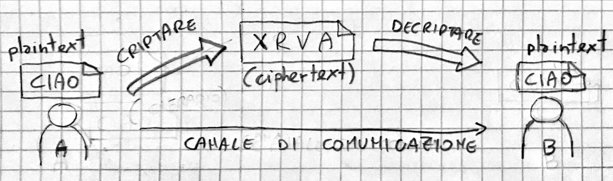

# Introduzione 
La **crittografia** o criptografia (dal greco: scrittura nascosta) è la tecnica che consente di rendere un messaggio comprensibile solo al destinatario. Il testo del messaggio viene sottoposto a "trasformazioni" che lo rendono <u>incomprensibile</u> agli altri soggetti. 

**N.B.** Tecniche che nascondono l'esistenza del messaggio non sono considerate tecniche crittografiche ma tecniche di **steganografia** (dal greco: scrittura coperta). Tra queste ricordiamo:

- Inchiostro simpatico
- Messaggio tatuato sulla testa di uno schiavo e mascherato dalla ricrescita dei capelli

Per capire i paragrafi seguenti è bene dare subito una definizione formale dei termini che verranno utilizzati:

> **Testo in chiaro**: in inglese *plaintext (/pleɪnˌtɛkst/)*, rappresenta in crittografia il testo originale da trasmettere.

> **Testo cifrato**: in inglese *ciphertext (/ˈsʌɪfəˌtɛkst/)*, rappresenta in crittografia il testo originale trasformato e quindi incomprensibile.

> **Criptare (cifrare, crittografare, crittare)**: in inglese *to encrypt (/ɛnˈkrɪpt/)*, trasformare il *plaintext* in *ciphertext*

> **Decriptare (decifrare, decriptare)**: in inglese *to decrypt (/diˈkrɪpt/)*, ritrasformare il testo cifrato in testo in chiaro 

> **Cifrario**: algoritmo utilizzato per eseguire operazioni di cifratura e decifratura del messaggio.

> **Chiave segreta**: in inglese *secret key (/ˈsiːkrɪt kiː/)*, è l'informazione segreta condivisa tra mittente e destinatario necessaria alle operazioni di cifratura e decifratura.

$$
Criptare \ne Codificare
$$

> **Codificare:** processo di conversione di un messaggio in un altro formato.  

La codifica di un messaggio può avere svariati scopi (invio dati, salvataggio, ecc.), ma <u>non</u> quello di mantenere la riservatezza del messaggio originale. Inoltre, la decodifica di un qualsiasi contenuto non richiede mai la conoscenza di una chiave, ma solo la conoscenza dell’algoritmo, che è tipicamente (e volutamente) noto. Un sistema di codifica molto utilizzato per le comunicazioni in Internet è ad esempio la codifica [Base64](https://it.wikipedia.org/wiki/Base64).

Quindi utilizzare il termine codificare come sinonimo di criptare <u>è tecnicamente sbagliato</u>.

*Schema 1 - **Invio e ricezione messaggio criptato***

~~**N.B.** la robustezza di un algoritmo crittografico può in alcuni casi essere data dalla segretezza dell’algoritmo utilizzato oltre che dalla chiave~~

?? chiave segreta ??

> **Crittoanalisi:** Strategia di ricostruzione del testo in chiaro a partire da uno o più testi cifrati di cui non si possiede la chiave. Tipicamente l’oggetto dell’analisi è la chiave segreta di accesso.

> **Tecnica brute force:** Vengono provate tutte le possibili chiavi fino a quando non viene compreso il testo cifrato.

$$
Crittografia + Crittoanalisi = Crittologia
$$

> La **crittologia** è la disciplina che studia tutti gli aspetti delle scritture nascoste.

Le tecniche crittografiche possono essere classificate in due principali sistemi: a **chiave simmetrica** e a **chiave asimmetrica**.

# Crittografia simmetrica
La crittografia a chiave simmetrica è un tecnica di crittografia in cui si utilizza <u>una sola chiave segreta</u>. Tale chiave è utilizzata dall’algoritmo di crittografia sia per criptare che per decriptare i messaggi. 
Il punto debole della crittografia simmetrica è  lo _scambio della chiave_ tra i due interlocutori (la chiave deve essere in un qualche modo comunicata tra le parti).

50ac Giulio Cesare
1500 Vigenère
1917 verman 
1920 enigma
1977 Des
1978 3des
2001 AES

## Algoritmo di Giulio Cesare 
Il cifrario di Giulio Cesare è uno dei primi algoritmi di crittografia conosciuti. E’ un algoritmo **simmetrico a sostituzione monoalfabetica**. Utilizza un alfabeto per il testo in chiaro e una permutazione dello stesso per il testo cifrato. La permutazione utilizzata costituisce la chiave del sistema. Durante la cifratura, ad ogni lettera del testo in chiaro viene associata la corrispondente lettera dell'alfabeto permutato. 

Il numero di possibili chiavi è dato dal numero dei caratteri che compongono l'alfabeto utilizzato (meno il primo carattere). In genere Giulio Cesare usava la chiave 3.

## Il cifrario di Vigenère
Il cifrario di Vigenère è un algoritmo di crittografia **simmetrico a sostituzione polialfabetica**. É il più semplice dei cifrari polialfabetici e fu inventato nel 1586 da  Blaise de Vigenère. Lo si può considerare una generalizzazione del cifrario di Cesare. Invece di spostare sempre dello stesso numero di posti la lettera da cifrare, questa viene spostata di un numero di posti variabile ma ripetuto, determinato in base ad una parola chiave (detta verme)

Testo chiaro  - RAPPORTOIMMEDIATO
Verme         - VERMEVERMEVERMEVE
Testo cifrato - MEGBSMXFUQHIUUEOS

Ha goduto per tre secoli la fama di essere un cifrario inattaccabile; nel 1863 il colonnello prussiano Friedrich Kasiski pubblicò un primo metodo di decrittazione; in seguito si sono trovati diversi altri efficienti metodi per forzare questo cifrario. La debolezza del Vigenère sta nell'essere, di fatto, un insieme di n cifrari di Cesare, dove n è la lunghezza della chiave; se il crittoanalista riesce a determinare la lunghezza della chiave (nel nostro caso, n) la decrittazione diventa molto semplice.

## Cifrario di Vernan
Il cifrario di Vernam o cifrario One Time Pad
Metodo usato dalle spie: matematicamente impossibile da decifrare (è chiamato il "cifrario perfetto"). Il problema è lo scambio della chiave che deve essere lunga come il messaggio da inviare.
Le spie venivano equipaggiate di taccuini (pad in inglese) contenenti una lunga chiave per ogni pagina, da poter strappare e gettare una volta utilizzata (one time, ovvero "un solo uso"). 

Testo in chiaro: C I A O
Chiave:          A J R F
\------------------------
Testo cifrato:   C R R T

## DES

## AES

# Crittografia asimmetrica

La crittografia asimmetrica è un metodo di cifratura delle informazioni che consente una gestione flessibile delle chiavi di cifratura. Essa prevede l'utilizzo di una coppia di chiavi (pubblica e privata) fra loro correlate; la caratteristica principale è che, conoscendo un chiave , non è tuttavia possibile risalire all’altra. Questa tecnologia consente sia di cifrare le informazioni (confidenzialità) che di firmarle (autenticità). 

Il nome delle chiavi deriva dal fatto che, mentre una viene scambiata liberamente nella rete e utilizzata da chiunque (chiave pubblica), l’altra deve essere utilizzata solo dal proprietario e quindi custodita attentamente (chiave privata).
 Il titolare della coppia di chiavi, in quanto unico soggetto a conoscenza della chiave privata, è il solo in grado di decifrare le informazioni a lui destinate, o di firmarle. 

Tutti gli altri soggetti utilizzando la chiave pubblica del titolare della coppia, possono essere in grado di verificare la firma del predetto titolare o di inviargli dei documenti confidenziali in tutta sicurezza.
 Nel campo pratico la crittografia asimmetrica viene, in genere, utilizzata in combinazione con quella simmetrica (crittografia che usa solo una chiave per cifrare e decifrare). 

Questo è dovuto al fatto che la crittografia a chiave pubblica è lenta ed è applicabile solamente per crittografare piccole quantità di informazioni, mentre la crittografia simmetrica è molto più veloce ed è adatta per crittografare grandi quantità di dati.
 La crittografia a chiave pubblica è utilizzata, principalmente, per consegnare una chiave simmetrica, in modalità sicura, alla persona con la quale si intende instaurare una comunicazione. Ad esempio se un client intende comunicare con un server, non deve far altro che inviargli una chiave simmetrica, crittografata con la chiave pubblica del server. In questo modo si è sicuri che solo il server, con la sua chiave privata, potrà decifrare il messaggio e conoscere la chiave simmetrica. Una volta avvenuto lo scambio della chiave di sessione, la comunicazione criptata può avere inizio. 

Gli algoritmi di crittorafia asimmetrica più conosciuti sono: RSA, Diffie-Hellman, DSA e Elliptic Curve Cryptography (ECC). Le tipiche lunghezze delle chiavi create con questi algoritmi sono costituite, in genere, da un numero ben preciso di bit: 384, 512, 768, 1024, 2048, 4096. All’aumentare della lunghezza della chiave aumenta anche lo sforzo necessario per fattorizzarla (trovare l’altra chiave corrispondente). Questo aumento avviene però in forma esponenziale e quindi una chiave da 1024 bit è incomparabilmente più sicura, da questo punto di vista, di una da 512. 

La crittografia a chiave pubblica non è più sicura di quella convenzionale, poiché la sicurezza di un qualsiasi schema di crittografia dipende dalla lunghezza della chiave e dal lavoro computazionale svolto per violare il sistema stesso. In genere, si consiglia di creare coppie di chiavi con almeno una lunghezza di 1024 bit (128 byte) ciascuna [23]. 

## Algoritmo RSA
### Lab: creazione chiavi con OpenSSL
## Altri algoritmi asimmetrici

# Funzioni hash

# Firma digitale

La firma digitale può essere definita l'equivalente elettronico di una tradizionale firma autografa apposta su carta, assumendone lo stesso valore legale.
 La firma è una parte di dati non falsificabile che garantisce che una determinata persona abbia scritto o comunque approvato il documento al quale è allegata la firma (autenticazione, non ripudio, integrità). 

Il destinatario di un messaggio con firma digitale è in grado di verificare sia che il messaggio è stato generato dalla persona che ha allegato la propria firma al messaggio, sia che non sia stato alterato intenzionalmente o involontariamente essendo stato firmato. 

Per apporre la firma digitale su un certificato si utilizza una coppia di chiavi asimmetriche e un algoritmo che prende il nome di funzione di hash. Si tratta di una particolare funzione che ricevendo in ingresso un numero qualsiasi (il grande numero binario che costituisce il documento da firmare), produce in uscita un numero molto più piccolo (una ventina di byte) il cui valore dipende in modo strettissimo dal valore di ingresso. Il valore ottenuto da questa elaborazione, si chiama impronta del documento originario, in quanto ne costituisce una sorta di impronta digitale. Questa funzione, inoltre, deve essere tale da garantire che modifiche anche minime al documento siano evidenziate con impronte differenti. 

Una volta ottenuta l'impronta del documento (ben più maneggevole del documento stesso) questa viene crittografata con la chiave privata del mittente. Il risultato di ciò è la vera firma digitale applicata al messaggio. Chi vuole verificare l'autenticità di un documento relativamente ad una data firma, non fa altro che applicare a sua volta la funzione convenzionale di hash per ricavarne l'impronta. Dopodiché prende la presunta firma e la decifra utilizzando la chiave pubblica dell'autore, ottenendo così una seconda impronta. Ora basta confrontare le due impronte, quella ricavata direttamente dal documento e quella ottenuta dalla decodifica mediante chiave pubblica: se esse coincidono si può avere la certezza che il documento è stato realmente generato dalla stessa persona che ne ha generato la 'firma'. 

*schema firma*

1. **Documento manipolato dalla "funzione di Hash"  
2. Creazione di un numero identificativo univoco ("valore di Hash").  
3. Il mittente utilizza la sua chiave privata e cifra il numero identificativo. 
4. Il risultato è la firma digitale, che viene poi unita al documento da spedire. 
5. Il destinatario che riceve il documento firmato decifra la firma con la chiave pubblica del mittente.  
6. Crea anch'egli tramite la stessa funzione di hash un numero identificativo per il documento ricevuto.  
7. Confronta il codice ottenuto con quello decriptato. Se sono uguali significa che il documento firmato corrisponde all'originale. 

Bisogna comunque tener presente che l'utilizzo della firma digitale non esegue la crittografia del messaggio. Se si desidera garantire la riservatezza del messaggio, si deve anche crittografarlo utilizzando la chiave pubblica della persona con cui si vuole instaurare una conversazione. In questo modo, solo quella persona potrà leggere il messaggio decifrandolo con la sua chiave privata. 

Un'altra considerazione da fare è che non è possibile che un utente rilevi un messaggio che esegue l'hashing di un valore specificato o trovi due messaggi che eseguano l'hashing dello stesso valore. Se entrambe le situazioni fossero possibili, un intruso potrebbe allegare un messaggio falso alla firma di un utente. Le funzioni di hash sono progettate in modo che risulti impossibile il rilevamento di una corrispondenza e sono quindi considerate appropriate per l'uso della crittografia. Documento e firma sono quindi legati tramite il codice di hash. Essi, possono essere fisicamente separati senza che per questo venga meno il legame esistente tra loro. Conseguenza di ciò è l’unicità della firma digitale, nel senso che a testi diversi corrispondono firme diverse e quindi, nonostante la sua perfetta replicabilità, è impossibile trasferirla da un documento ad un altro. 

*schema verifica firma*

## Lab: creazione firma digitale con GPG

# Certificati digitali

Il crescente utilizzo di servizi automatizzati ha portato alla ribalta il problema della sicurezza nello scambio di informazioni. In generale, quando due sistemi intendono scambiarsi dati, si avrà bisogno di un canale di comunicazione sicuro, cioè privo di intercettazioni e del riconoscimento tra le rispettive parti che intendono procedere allo scambio di informazioni. 

In particolare, nel mondo di Internet, in cui le comunicazioni avvengono tra utenti totalmente sconosciuti, questo ultimo aspetto risulta più che mai importante. Il riconoscimento tra le parti coinvolte, garantisce infatti, che lo scambio di informazioni sia al tempo stesso sicuro e funzionale. Esso rappresenta, oggi, l'aspetto determinante in una comunicazione sicura. 

In una normale transazione, non si può mai, con certezza, sapere con chi si sta parlando e a chi si stanno inviando informazioni. Ci deve essere quindi un meccanismo di riconoscimento per avere certezza che l'interlocutore con il quale si sta conversando è effettivamente chi dice di essere. 

Nella rete, il riconoscimento dell'interlocutore è sinonimo di fiducia. In particolare esistono due importanti forme di fiducia: fiducia nella ‘terza-parte’ (third-party trust) o indiretta e fiducia personale o diretta. Lo scambio sicuro di informazioni digitali avviene tramite la fiducia indiretta.
 Il concetto di fiducia indiretta si riferisce ad una situazione nella quale due soggetti si fidano implicitamente l’uno dell’altro senza conoscersi direttamente. La reciproca fiducia può sussistere, perché esiste un terzo individuo che garantisce direttamente ognuno dei due sull'affidabilità dell’altro. La fiducia nella ‘terza-parte’ è un requisito fondamentale per qualsiasi implementazione su larga scala di un sistema sicuro. Infatti, in una qualsiasi rete, è impraticabile e irrealistico aspettarsi che ogni individuo abbia preventivamente stabilito relazioni con tutti gli altri. 

### Come nasce l'esigenza dei certificati digitali?

L'idea di certificato digitale nasce dalla problematica che chiunque potrebbe depositare una chiave pubblica a nome di un altro e falsificare la comunicazione. Affinché tutto il sistema funzioni e dia garanzie di fiducia, occorre la presenza di un’infrastruttura di certificazione che garantisca l'effettiva identità di ciascuno. 

> **Certificato digitale:** è un documento elettronico, rilasciato da un'autorità di certificazione, che attesta la corrispondenza tra una chiave pubblica e  l'identità di un soggetto (persona, organizzazione, computer).

In pratica il certificato digitale diventa equivalente alla carta d'identità: come infatti un documento rilasciato dallo Stato serve per verificare l'identità di una persona, così un certificato digitale serve per verificare l'identità degli utenti o dei sistemi della rete. Alla base di tutto, in entrambi i casi, vi è la fiducia degli utenti nell'ente che rilascia questi documenti, siano essi digitali che cartacei. 

> **CA (Certification Authority):** è un organismo, al di sopra delle parti, che rilascia certificati digitali dopo aver verificato l'identità di ogni richiedente. Si pone quindi da garante verso terzi dell'identità digitale di un soggetto (fiducia indiretta, in inglese "third-party trust").

Un certificato digitale tipicamente include: 

- una chiave pubblica
- i dati identificativi del proprietario
- un periodo di validità (valido dal-al)
- l'URL della lista dei certificati revocati (CRL)

Il tutto è firmato dalla CA che emette il certificato. 

*schema richiesta certificato*

Una volta emesso, il certificato digitale può essere scambiato liberamente o pubblicato su Internet, in modo da lasciarne una copia a chiunque si desideri o a chiunque ne faccia richiesta. Lo scambio libero di un certificato non pregiudica la sicurezza del certificato stesso e l’integrità della coppia di chiavi. 

**N.B.** Mentre la chiave pubblica ha bisogno di un certificato che la possa contenere e associare ad un soggetto, la chiave privata, non essendo mai condivisa, non richiede un contenitore, ma viene semplicemente archiviata in modo sicuro all’interno di un qualsiasi strumento di memorizzazione.  

### CA

Ogni CA può essere o una RootCA (quindi fungere da radice della catena di certificazione) o una SubCA (SubordinateCA, Ca intermedia) e quindi con compiti delegati dalla CA di livello superiore. 

*schema gerarchia CA*

In genere una RootCA genera certificati per CA subordinate e non per soggetti finali.

Ogni CA dispone del proprio certificato digitale, che permette agli utenti di controllare la validità di un certificato emesso andando a verificarne la firma digitale in esso contenuta. Il certificato di una CA è firmato dalla CA di livello superiore. 

Se la CA di root è la radice dell'albero chi le firma il certificato? La risposta è molto semplice: la CA firma da sé il proprio certificato (certificato self-signed). In pratica crea la richiesta di rilascio di un certificato e la firma con la sua chiave privata. Da qui si evince la necessità della *buona reputazione* di una CA: in pratica non c'è nessuna autorità garante dal punto di vista architetturale sopra la RootCA; è necessario quindi passare a forme di garanzia giuridiche.

Per riepilogare, una CA ha quindi l'obbligo di: 

- identificare con certezza la persona che fa richiesta della certificazione
- rilasciare e rendere pubblico il proprio certificato
- procedere tempestivamente alla revoca ed alla sospensione dei certificati degli utenti, dandone immediata pubblicazione (CRL) 

### CRL e revoca dei certificati

> **CRL (Certificate Revocation List):** è un elenco (firmato digitalmente) di certificati digitali che sono stati revocati dalla CA prima della loro data di scadenza e che non dovrebbero più essere considerati attendibili.

Ogni certificato elettronico generato ha una validità temporale limitata al cui termine va sostituito. Il periodo di validità di un certificato (scelto in genere dalla CA) garantisce l’utente che deve utilizzare tale certificato. 

Sino al periodo di scadenza, infatti, la chiave pubblica e le informazioni incluse nel certificato potranno essere a tutti gli effetti ritenute valide.

Tuttavia possono intervenire fattori per cui è necessario l'annullamento o la revoca del certificato prima del suo prestabilito periodo di scadenza: può accadere che l'utente abbia cambiato i suoi dati e che questi quindi, non coincidano più con quelli riportati sul certificato, o potrebbe accadere che l'autorità di certificazione abbia verificato un utilizzo irregolare del certificato, o ancora si potrebbe sospettare di una probabile manomissione della chiave privata e quindi della sua intercettazioni da parte di una terza persona. Per questi e altri fattori è necessario che in qualsiasi momento sia l'utente sia l'autorità di certificazione abbiano la facoltà di revocare il certificato. 

La difficoltà legata al processo di revoca emerge dalla necessità di garantire una corretta notifica, su larga scala, dell’avvenuta revoca di un particolare certificato; ogni qualvolta si intende utilizzare un certificato o per cifrare dati o per verificare una firma, si deve essere, infatti, informati sullo stato di quel certificato.
 Il meccanismo utilizzato per la notifica su larga scala di avvenute revoche fa uso delle cosiddette liste di revoca dei certificati (Certificate Revocation List o CRL). Nell’ambito del dominio amministrato, ogni CA ha il compito di pubblicare periodicamente una struttura dati contenente l’elenco dei certificati revocati, ossia una lista, firmata digitalmente dall’Autorità di certificazione, che riporta i certificati revocati, la data temporale in cui è avvenuta la revoca ed eventualmente il motivo della revoca. 

La frequenza di pubblicazione di una CRL dipende fortemente dalla politica di sicurezza definita all’interno della CA. Generalmente si sceglie di rilasciare liste ad intervalli periodici definibili a livello di policy. Logicamente minori sono gli intervalli di tempo, maggiore risulta essere la sicurezza di tutto il sistema. E’ possibile anche aggiornare le CRL ogni qualvolta venga effettuata una revoca; tuttavia tale soluzione risulta essere assai dispendiosa in termini di gestione e quindi poco adottata in campo pratico. 

