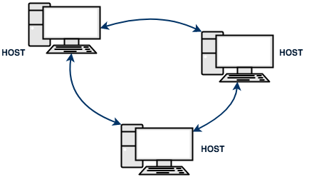

# Reti di computer

> **Rete di computer:** o rete telematica, è un sistema di comunicazione che permettte l'interconnesione di strutture informatiche distribuite su aree geografiche di qualsiasi ampiezza.

> **Host:** qualsiasi computer o dispositivo informatico connesso ad una rete telematica

Affinchè i computer possano comunicare in rete, è necessario, oltre che siano connessi tra loro, che esistano dei <u>protocolli di comunicazione</u> standard che regolino lo scambio di informazioni.

> **Protocollo di comunicazione:**in inglese *communication protocol (/kəˌmjuːnɪˈkeɪʃən ˈprəʊtəˌkɒl/)*  insieme di regole che governano la comunicazione tra due host della rete.

## Modello client/server

Il modello di comunicazione più utilizzato in una rete di computer è il modello client/server. Tale modello prevede che nella comunicazione tra due dispositivi uno assuma il ruolo di client (il richiedente) e l'altro il ruolo di server (il servente).

> **Client:** un host della rete che accede ai servizi o alle risorse di un altro host della rete detto server

> **Server:** un host della rete che fornisce risorse o servizi ad altri host che ne fanno richiesta

## Tipologie di comunicazione 

- unicast
- multicast
- broadcast

## Struttura di una rete

Per costruire fisicamente una rete di computer dobbiamo avere a disposizione:

- almeno due host
- almeno una scheda di rete per ogni host
- un canale di comunicazione che permetta la trasmissione dei dati
- un software in ogni host che "conosca" i protocolli di comunciazione
- un dispositivo di rete in grado di gestire il canale di comunicazione