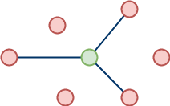
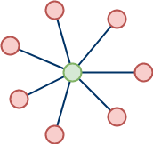

# Reti di computer

> **Rete di computer:** in inglese *network (/ˈnɛtˌwɜːk/)*, è un sistema di comunicazione che permettte l'interconnesione di strutture informatiche distribuite su aree geografiche di qualsiasi ampiezza.

> **Host:** qualsiasi computer o dispositivo informatico connesso ad una rete telematica

Affinchè i computer possano comunicare in rete, è necessario, oltre che siano connessi tra loro, che esistano dei <u>protocolli di comunicazione</u> che regolino lo scambio di informazioni.

> **Protocollo di comunicazione:**in inglese *communication protocol (/kəˌmjuːnɪˈkeɪʃən ˈprəʊtəˌkɒl/)*  insieme di regole che governano la comunicazione tra gli host della rete.

In base al ruolo che assume nella comunicazione, un host della rete può essere un client o un server:

> **Client:** *(/ˈklaɪənt/)* un host della rete che accede ai servizi o alle risorse di un altro host della rete detto server

> **Server:** *(/ˈsɜːvə/)* un host della rete che fornisce risorse o servizi agli host client che ne fanno richiesta

Quando vengono trasferiti file dal server al client e viceversa parliamo rispettivamente di *download* e *upload*.

> **Download:** *(/ˈdaʊnˌləʊd/)* trasferimento di un file dal server al client

> **Upload:** *(/ʌpˈləʊd/)* trasferimento di un file dal client al server

## Modelli di comunicazione

In una rete di computer, esistono vari modi in cui gli host interagiscono tra di loro scambiandosi dati. I principali modelli di comunciazione solo il modello client/server e il modello peer-to-peer.

### Modello client/server

Il modello di comunicazione più utilizzato in una rete di computer è il modello client/server. Tale modello prevede che nella comunicazione tra due dispositivi un host assuma il ruolo di client (il cliente) ed un altro il ruolo di server (il serviente).

Nel modello client/server è <u>sempre</u> il client che inizia la comunicazione inviando una **request** (richiesta) mentre il server può solo rispondere alla richiesta tramite una **response**.

**N.B.** un host che in una comunicazione assume il ruolo di client, può assumere il ruolo di server in un'altra distinta comunicazione. Nella stessa comunicazione i ruoli però restano <u>fissi</u>.

### Modello peer-to-peer

Nel peer-to-peer (pari a pari) gli host della rete non hanno un ruolo specifico come nel modello client/server. Ogni host è contemporaneamete sia client che server, ed è in grado, quindi, sia di avviare che di rispondere ad una comunicazione.  

Un'applicazione del modello peer-to-peer la si trova nei programmi di file-sharing che utilizzano il protocollo Torrent.

## Tipologie di comunicazione 

In base al numero di host coinvolti nella comunicazione possiamo distinguere tre diverse tipologie di trasferimento dati:

|Unicast|Multicast|Broadcast|
| :-----: | :-------: | :-------: |
|   Un host invia dati ad un altro host della rete |  Un host invia dati a due o più host della rete |  Un host invia dati a tutti gli host della rete |

## Tipologie di reti

A seconda dell'estensione geografica, si distinguono tre diversi tipi di reti: 

- LAN (Local Area Network)
- MAN (Metropolitan Area Network)
- WAN (Wide Area Network)

## Struttura di una rete

Per costruire fisicamente una rete di computer dobbiamo avere a disposizione:

- almeno due host
- almeno una scheda di rete per ogni host
- un canale di comunicazione che permetta la trasmissione dei dati
- un software in ogni host che "conosca" i protocolli di comunciazione
- un dispositivo di rete in grado di gestire il canale di comunicazione (hub,switch)

## Canali di comunicazione

Il canale di comunicazione o canale trasmissivo è il mezzo utilizzato per collegare gli host di una rete. Esso può essere di 3 tipi:

- elettrico (cavi in rame)
- ottico (fibre ottiche)
- elettromagnetico (onde radio)

La velocità di trasmissione di un canale di comunicazione viene in genere misurata in b/s (bit al secondo) o sui multipli: Kb/s, Mb/s, Gb/s.

La velocità dichiarata di uno specifico canale (capacità) rappresenta la massima quantità di dati trasportabile. Tuttavia la velocità reale è sempre inferiore alla capacità dichiarata in quanto subentrano vari fattori (ambientali,umani) che possono creare interferenza nel canale (rumore) e rallentarne la velocità.

|  b (bit)  | B (Byte) |
| --- | --- |
|    |    |
|    |    |
|    |    |
|    |    |

N.B. Mentre per la misura della velocità si prende come riferimento il bit, per la misura delle memorie del computer si utilizza il Byte simbolo B (1 Byte=8 bit). Nel calcolare i tempi di trasferimento bisogna quindi fare attenzione alla conversione delle unità di misura.